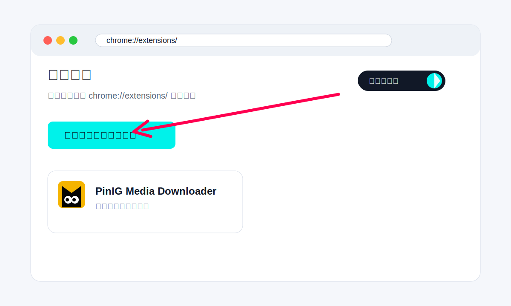
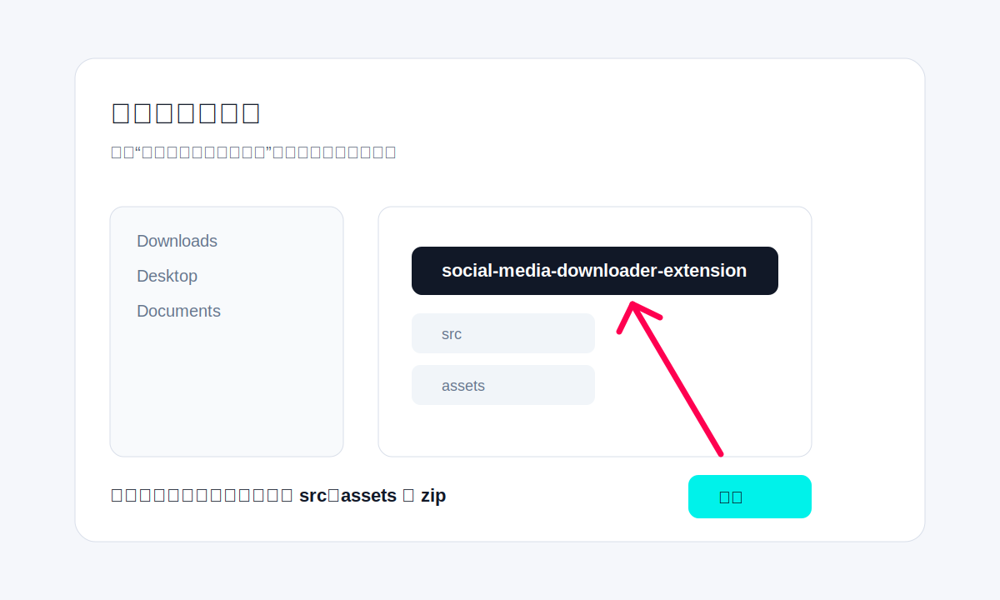
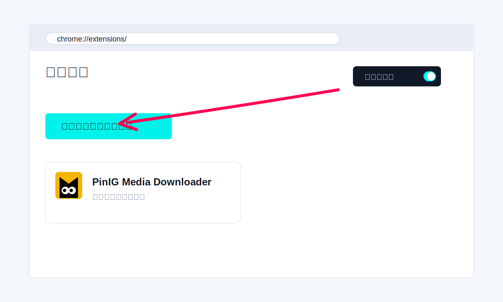
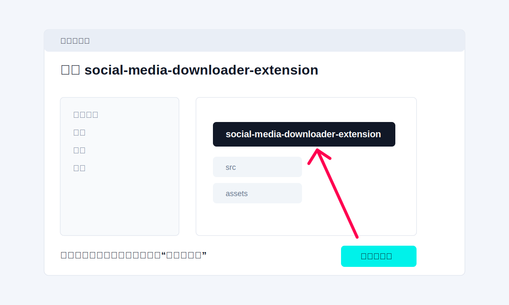

# PinIG Media Downloader 团队安装教程

这份教程给团队成员使用。安装后可以在 Instagram 和 Pinterest 页面下载单张或批量下载图片/视频。

## 方式一：使用 Git 同步安装

适合会使用 Git 的同事。

```bash
git clone <your-repo-url>
```

然后在 Chrome 里加载 clone 下来的 `social-media-downloader-extension` 文件夹。

后续更新：

```bash
git pull
```

更新后打开 `chrome://extensions/`，点击 PinIG Media Downloader 卡片上的刷新按钮。

## 方式二：下载 ZIP 安装

适合不会 Git 的同事。

1. 打开仓库页面。
2. 点击 `Code` 或 `Download`。
3. 选择 `Download ZIP`。
4. 解压 ZIP。
5. 在 Chrome 里加载解压后的 `social-media-downloader-extension` 文件夹。

注意：Chrome 需要选择解压后的文件夹，不是选择 ZIP 文件。

## macOS Chrome 安装步骤

### 1. 打开扩展管理页

在 Chrome 地址栏输入：

```text
chrome://extensions/
```



### 2. 开启开发者模式并加载插件

打开右上角 `开发者模式`，然后点击 `加载已解压的扩展程序`。



### 3. 选择插件目录

选择这个文件夹：

```text
social-media-downloader-extension
```

不要选择 `src`、`assets` 或 ZIP 文件。

### 4. 固定插件

点击 Chrome 右上角拼图图标，把 `PinIG Media Downloader` 固定到工具栏。

## Windows Chrome 安装步骤

### 1. 打开扩展管理页

在 Chrome 地址栏输入：

```text
chrome://extensions/
```



### 2. 开启开发者模式并加载插件

打开右上角 `开发者模式`，点击 `加载已解压的扩展程序`。



### 3. 选择插件目录

在文件选择窗口里选择：

```text
social-media-downloader-extension
```

点击 `选择文件夹`。

## 使用方式

1. 打开 Instagram 或 Pinterest 页面。
2. 页面右下角会出现 `PinIG Downloader` 面板。
3. 下拉框可选择：
   - `All photos + videos`
   - `Photos only`
   - `Videos only`
4. 点击 `Scan page` 扫描当前页面。
5. 点击 `Download` 批量下载。
6. 面板可以拖动，也可以拖右下角调整大小。

## 更新插件

### Git 用户

```bash
git pull
```

然后打开 `chrome://extensions/`，点击插件卡片上的刷新按钮。

### ZIP 用户

重新下载最新 ZIP，解压并覆盖旧目录，然后打开 `chrome://extensions/`，点击插件卡片上的刷新按钮。

## 常见问题

### 页面上没出现面板

刷新当前 Instagram/Pinterest 页面。如果还没有出现，打开 `chrome://extensions/`，确认插件已启用。

### 下载数量不完整

Instagram 和 Pinterest 会懒加载内容。先向下滚动页面，或者点击面板里的 `Load more`，再下载。

### Chrome 提示开发者模式风险

这是 Chrome 对所有本地加载插件的提示。团队内部使用本仓库代码即可，不要安装来源不明的扩展。
